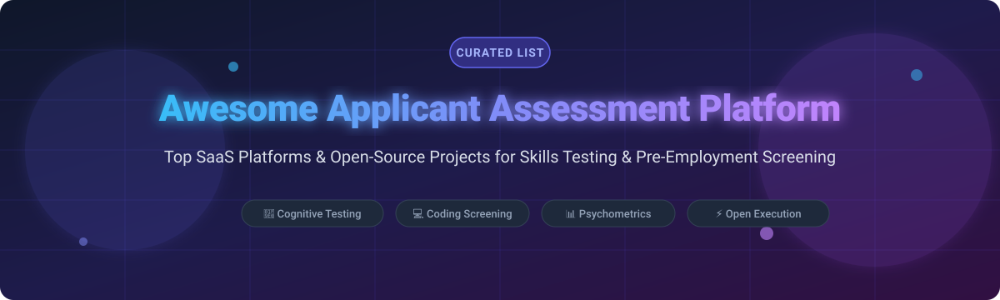

# 🎯 Awesome Applicant Assessment Platform

  

  
  
  
  
  

## 🚀 Top Applicant Assessment Platform Ecosystem

A curated directory of **SaaS Products**, **Open-Source Software**, and **Technical Screening Tools** for HR tech, pre-employment testing, coding evaluations, and candidate skill verification.

---

## 📑 Table of Contents

- [🌐 SaaS / Hosted Assessment Platforms](#-saas--hosted-assessment-platforms)
- [🔓 Open-Source GitHub Projects](#-open-source-github-projects)
- [🤝 How to Contribute](#-how-to-contribute)
- [☕ Support](#-support)
- [📈 Star History](#-star-history)
- [⚠️ Disclaimer](#%EF%B8%8F-disclaimer)

---

## 🌐 SaaS / Hosted Assessment Platforms

> 💡 **Market Size & Structure**: The global pre-employment testing and talent assessment software market is estimated at **$1.9 Billion (2024)** and is projected to reach **$3.2 Billion by 2030** (growing at ~9.2% CAGR). The market is **moderately fragmented**, featuring a mix of established HR tech enterprise suites (Criteria Corp, Mercer Mettl, Harver) and fast-growing specialized assessment providers (TestGorilla, Testlify, Adaface).

The table below lists leading commercial candidate assessment platforms, sorted by estimated company size (Revenue / Valuation) in descending order:

| Platform 🏢 | Estimated Size / Revenue 💰 | Starting Pricing Tier 🏷️ | Free Tier / Free Trial Limits 🎁 | Key Features & Focus ⚡ |
| :--- | :--- | :--- | :--- | :--- |
| **[Mercer Mettl](https://mettl.com/)** | Acquired by Mercer / Marsh McLennan ($20B+ Corp Revenue) | ~$2,000/year (Custom quote minimums) | 14-Day Free Trial (sales-assisted demo account) | Enterprise skill assessment, online proctoring, cognitive batteries & certification suites. |
| **[Criteria Corp](https://www.criteriacorp.com/)** | ~$30.0M ARR / ~$64.3M Total Raised | ~$5,000/year flat-rate subscription | 14-Day Free Trial (qualified enterprise buyers) | Pre-employment cognitive tests, personality assessments, and emotional intelligence evaluations. |
| **[Wonderlic](https://www.criteriacorp.com/)** | ~$25.9M Annual Revenue | ~$1,000/year base platform package | Free sample demo & practice assessments | Industry-standard cognitive ability tests (WonScore), motivation, and personality screening. |
| **[Harver](https://harver.com/)** | ~$20.0M ARR | ~$5,000/year entry enterprise tier | Demo account with sample candidate workflow | High-volume automated hiring, situational judgment tests (SJT), and talent evaluation. |
| **[TestGorilla](https://www.testgorilla.com/)** | ~$36.2M ARR / ~$81.2M Total Raised | $1,704/year ($142/mo billed annually - Core Plan) | **Free-Forever Plan** (10 credits/month & access to 5 foundational test batteries) | Comprehensive skills assessment library, custom test building, coding screens, & ATS integration. |
| **[Vervoe](https://vervoe.com/)** | ~$3.0M ARR / ~$4.5M Total Raised | ~$9,800/year entry business plan | 14-Day Free Trial (limited candidate tests) | AI-powered skills testing, job simulations, and automated candidate grading. |
| **[HiPeople](https://hipeople.io/)** | ~$1.3M ARR / ~$6.8M Total Raised | ~$1,188/year ($99/mo billed annually) | 7-Day Free Trial (3 candidate assessments included) | Automated candidate reference checks, background insights, and talent assessment. |
| **[Testlify](https://testlify.com/)** | Private (~$1M–$3M ARR est.) | $1,668/year (Starter Tier) | 7-Day Free Trial (10 candidate assessment invites) | Fast credit-based candidate skills testing, coding tests, and anti-cheating video monitoring. |
| **[Adaface](https://www.adaface.com/)** | Private (~$1M–$2M ARR est.) | $180/year (Individual Plan) | 14-Day Free Trial (1 candidate test invitation included) | Conversational AI coding challenges, pair programming screens, & technical skill tests. |
| **[eSkill](https://eskill.com/)** | Acquired by Scaleworks (Private PE) | ~$4,800/year ($400/mo billed annually) | Demo account upon request | Flexible skills assessment engine, custom test builder, and extensive pre-made test library. |

---

## 🔓 Open-Source GitHub Projects

Below are open-source talent screening engines, coding interview platforms, quiz software, and assessment tools. Sorted by GitHub Star Count (descending).

| Repository & Link 📦 | GitHub Stars 🌟 | Description & Ecosystem Focus 🛠️ |
| :--- | :--- | :--- |
| **[formbricks/formbricks](https://github.com/formbricks/formbricks)** |  | Open-source experience management & survey platform—ideal for candidate feedback, screening forms, and custom questionnaires. |
| **[openedx/edx-platform](https://github.com/openedx/edx-platform)** |  | The core open-source learning and assessment platform powering Open edX—supports complex candidate testing, graded problem sets, & proctoring. |
| **[moodle/moodle](https://github.com/moodle/moodle)** |  | World's most popular open LMS; widely deployed for candidate knowledge exams, psychometric questionnaires, and certification tests. |
| **[instructure/canvas-lms](https://github.com/instructure/canvas-lms)** |  | Open-source learning engine with advanced quiz/exam modules adaptable to workforce evaluation and skills verification. |
| **[judge0/judge0](https://github.com/judge0/judge0)** |  | Robust open-source online code execution engine powering many technical hiring platforms; sandboxed execution for 60+ languages. |
| **[LimeSurvey/LimeSurvey](https://github.com/LimeSurvey/LimeSurvey)** |  | Open-source survey software heavily used for candidate background evaluation, psychometric assessments, & structured HR scoring. |
| **[ohcnetwork/care](https://github.com/ohcnetwork/care)** |  | Open-source telemetry, questionnaire, and workforce management framework adaptable for custom assessment pipelines. |
| **[CoderScreen/coderscreen](https://github.com/CoderScreen/coderscreen)** |  | Open-source technical hiring platform featuring live coding interviews, automated test grading, and sandboxed code execution. |
| **[hb1998/CodeGaze](https://github.com/hb1998/CodeGaze)** |  | Open-source coding screening platform featuring custom coding challenges, candidate invites, and automated test scoring. |
| **[nikolap994/recruit_em](https://github.com/nikolap994/recruit_em)** |  | Open-source recruitment & assessment questionnaire system for applicant history, positions, and reusable tests. |

---

## 🤝 How to Contribute

Contributions are always welcome! 

1. **Fork** the repository.
2. **Add/Edit** entries in `README.md` following the tabular format.
3. **Include** accurate pricing tier, free trial info, star links, or commercial status.
4. **Submit a Pull Request** with a concise summary of changes.

---

## ☕ Support

If you find this repository helpful for your hiring infrastructure or developer research, please consider supporting the project:

- ⭐ **Star this repository** to help others discover it!
- 🔀 **Fork & Share** with your engineering and talent acquisition networks.
- ☕ **Buy me a coffee**: Sponsor developer tools and open-source lists via the [GitHub Sponsor Dashboard](https://github.com/sponsors/ishandutta2007).

Thank you for supporting open-source software and transparent HR technology! 💖

---

## 📈 Star History

---

## ⚠️ Disclaimer

- This is a **community-curated** list intended solely for informational and educational purposes.
- Pre-employment assessment tools should be used in compliance with local employment laws (e.g., EEOC, GDPR). Automated scoring systems should complement, rather than replace, human judgment in talent evaluation.
